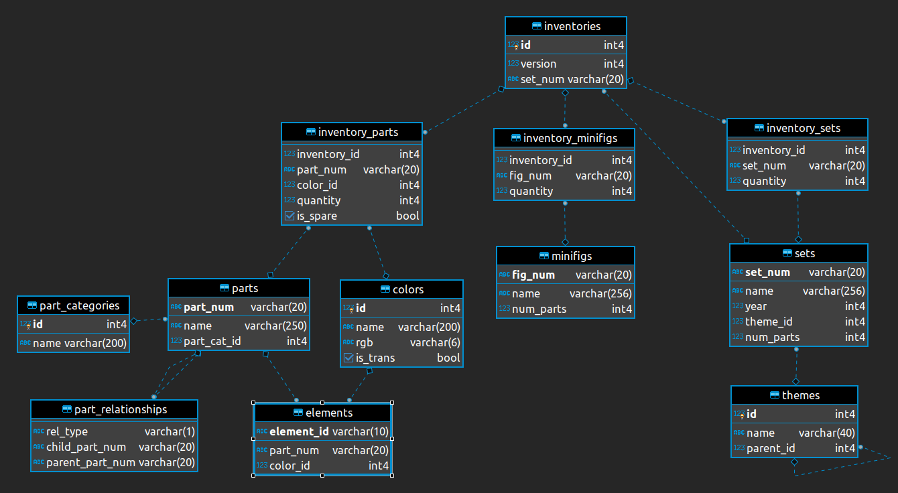

<style>
body { 
text-align: justify}
</style>

```{r ustawienia, include=F}
knitr::opts_chunk$set(echo=F, warning=F, message=F)
```

# Podsumowanie analizy

W raporcie analizie poddany został składający się z 12 tabel zbiór danych dotyczący LEGO, pochodzący z bazy Rebrickable. W [pierwszej sekcji](#wykorzystane-biblioteki) znajduje się kod odpowiedzialny za import wszystkich wykorzystanych w raporcie bibliotek. [Kolejna sekcja](#wczytanie-danych) zawiera kod odpowiedzialny za wczytanie danych. Następnym elementem raportu jest [opis zbioru danych](#opis-zbioru-danych), czyli krótki opis każdej tabeli i jej parametrów oraz wyświetlenie ich podstawowych statystyk i liczności tabeli. W kolejnej [sekcji](#analiza-danych) znajduje się analiza danych. Zawarte tam zostały wykresy i tabele podsumowujące dane dotyczące LEGO. W sekcji [Trendy](#trendy) przeanalizowano zachodzące zmiany dotyczące LEGO na przestrzeni lat. Sekcja [Korelacja](#korelacja) zawiera analizę zależności pomiędzy wybranymi cechami zbioru. W sekcji [Klasyfikacja](#klasyfikacja) przygotowano model uczenia maszynowego próbujący przewidzieć średnią liczbę części na jeden zestaw. Wykorzystano do tego algorytm Random Forest z zastosowaniem walidacji krzyżowej. W ostatniej [sekcji](#predykcja-forecasting) zastosowano bibliotekę forecast (model Arima) w celu próby prognozy zmian wartości wybranych cech LEGO w następnych latach. 

Wnioski z raportu:

- Prawie wszystkie (około 98,9%) części LEGO wykonane są z plastiku. Następnym materiałem wykorzystywanym przy produkcji LEGO jest guma (około 0,71%). [[rys](#rozkład-materiałów)]
- Najczęściej występującą figurką LEGO jest figurka szkieletu. Innymi popularnymi figurkami są te związane z zawodami, sagą Star Wars czy grą Minecraft. [[rys](#najpopularniejsze-figurki)]
- Najbardziej popularnymi tematykami zestawów są: Books, Star Wars i Technic. [[rys](#najpopularniejsze-tematyki)]
- Największym zestawem jest zestaw "World Map" składający się z blisko 12 tysięcy części. [[rys](#największe-zestawy)]
- Najpopularniejsze kolory klocków LEGO to czarny i biały. [[rys](#najpopularniejsze-kolory)]
- Uniwersalne klocki są najpopularniejsze. [[rys](#najpopularniejsze-czesci)]
- Większość klocków jest nieprzezroczysta. [[rys](#przezroczystosc-czesci)]
- Najbardziej złożoną tematyką jest "Collectable Minifgures". Składa się ona z największej liczby "podmotywów". [[rys](#najbardziej-zlozone-motywy)]
- Z roku na rok w zestawach łącznie wykorzystywanych jest co raz więcej figurek [[rys1](#trend-figurki-zestawy)], co ma również związek ze stale rosnącą liczbą wydawanych zestawów [[rys2](#trend-zestawy)]
- W ostatnich latach widać delikatny spadek średniej liczby elementów składających się na jedną część. [[rys](#trend-elementy-czesc)]
- Istnieje trend związany z rosnącą średnią liczbą klocków w zestawie. Zestawy są co raz bardziej złożone. [[rys](#trend-czesci-zestaw)]
- Liczba nowych tematyk (motywów) rośnie wraz z biegiem lat. [[rys](#trend-tematyki)]


# Wykorzystane biblioteki {#wykorzystane-biblioteki}

Do stworzenia raportu wykorzystano następujące biblioteki:

```{r ladowanie_bibliotek, echo=T} 
library(knitr)
library(dplyr)
library(ggplot2)
library(skimr)
library(plotly)
library(caret)
library(ggeasy)
library(formattable)
library(tidyverse)
library(scales)
library(ggcorrplot)
library(forecast)
```

W celu uzyskania powtarzalności rezultatów ustawiono ziarno dla generatora liczb pseudolosowych.

```{r ustawienie_ziarna, echo=T}
set.seed(23)
```

# Wczytanie danych {#wczytanie-danych}

Poniżej znajduje się kod odpowiedzialny za wczytanie danych z plików.

```{r wczytanie_danych, echo=T, cache=T}
inventories <- read.csv("rebrickable/inventories.csv")
inventory_parts <- read.csv("rebrickable/inventory_parts.csv")
parts <- read.csv("rebrickable/parts.csv")
part_categories <- read.csv("rebrickable/part_categories.csv")
part_relationships <- read.csv("rebrickable/part_relationships.csv")
elements <- read.csv("rebrickable/elements.csv")
colors <- read.csv("rebrickable/colors.csv")
inventory_minifigs <- read.csv("rebrickable/inventory_minifigs.csv")
minifigs <- read.csv("rebrickable/minifigs.csv")
inventory_sets <- read.csv("rebrickable/inventory_sets.csv")
sets <- read.csv("rebrickable/sets.csv")
themes <- read.csv("rebrickable/themes.csv")
```

# Opis zbioru danych

Cały zbiór danych dotyczący klocków LEGO składa się z 12 tabel. Na obrazku poniżej przedstawiono ich schemat.



Poniżej znajdują się sekcje zawierające opisy każdej z tabel, informacje o ich rozmiarze oraz podstawowe statystyki.

## Inventories

Jest to tabela nadrzędna łącząca części i figurki z zestawami LEGO.
<br> Tabela zawiera **`r nrow(inventories)`** rekordów.

Atrybuty w tej tabeli to:

* **id**
* **version** - numer wersji
* **set_num** - numer zestawu

```{r opis_danych_inventories}
kable(summary(inventories), align = "l", caption = "Podstawowe statystyki danych z tabeli")
kable(head(inventories), align = "l", caption = "Kilka pierwszych elementów z tabeli")
skim(inventories)
```

## Inventory Parts

W tej tabeli zostały zawarte informacje o zapasach (nakładach) części LEGO.
<br> Tabela zawiera **`r nrow(inventory_parts)`** rekordów.

Atrybuty w tej tabeli to:

* **inventory_id**
* **part_num** - oznaczenie części
* **color_id** - numer koloru
* **quantity** - ilość
* **is_spare** - zmienna typu bool, określająca czy część jest zapasowa
* **img_url** - adres url zdjęcia części

```{r opis_danych_inventory_parts}
kable(summary(inventory_parts), align = "l", caption = "Podstawowe statystyki danych z tabeli")
kable(head(inventory_parts), align = "l", caption = "Kilka pierwszych elementów z tabeli")
skim(inventory_parts)
```

## Parts

Tabela **parts** zawiera informacje o częściach LEGO, które mogą składać się z kilku elementów.
<br> Tabela zawiera **`r nrow(parts)`** rekordów.

Atrybuty w tej tabeli to:

* **part_num** - oznaczenie części
* **name** - nazwa części
* **part_cat_id** - id kategorii części
* **part_material** - materiał, z którego wykonano część

```{r opis_danych_parts}
kable(summary(parts), align = "l", caption = "Podstawowe statystyki danych z tabeli")
kable(head(parts), align = "l", caption = "Kilka pierwszych elementów z tabeli")
skim(parts)
```

## Part Categories

Tabela **part_categories** zawiera informacje o kategoriach części LEGO.
<br> Tabela zawiera **`r nrow(part_categories)`** rekordów.

Atrybuty w tej tabeli to:

* **id**
* **name** - nazwa kategorii części

```{r opis_danych_part_categories}
kable(summary(part_categories), align = "l", caption = "Podstawowe statystyki danych z tabeli")
kable(head(part_categories), align = "l", caption = "Kilka pierwszych elementów z tabeli")
skim(part_categories)
```

## Part Relationships

W tej tabeli zostały zawarte informacje o relacjach między poszczególnymi częściami.
<br> Tabela zawiera **`r nrow(part_relationships)`** rekordów.

Atrybuty w tej tabeli to:

* **rel_type** - oznaczenie relacji
* **child_part_num** - oznaczenie części "dziecka"
* **parent_part_num** - oznaczenie części "rodzica"

```{r opis_danych_part_relationships}
kable(summary(part_relationships), align = "l", caption = "Podstawowe statystyki danych z tabeli")
kable(head(part_relationships), align = "l", caption = "Kilka pierwszych elementów z tabeli")
skim(part_relationships)
```

## Elements

W tabeli **elements** znajdują się informacje o pojedynczych klockach LEGO.
<br> Tabela zawiera **`r nrow(elements)`** rekordów.

Atrybuty w tej tabeli to:

* **element_id**
* **part_num** - oznaczenie części, w której skład wchodzi dany element
* **color_id** - numer koloru
* **design_id**

```{r opis_danych_elements}
kable(summary(elements), align = "l", caption = "Podstawowe statystyki danych z tabeli")
kable(head(elements), align = "l", caption = "Kilka pierwszych elementów z tabeli")
skim(elements)
```

## Colors

Tabela **colors** zawiera informacje o oficjalnych kolorach klocków LEGO.
<br> Tabela zawiera **`r nrow(colors)`** rekordy.

Atrybuty w tej tabeli to:

* **id**
* **name** - nazwa koloru
* **rgb** - kolor zapisany w formacie RGB
* **is_trans** - zmienna typu bool, określająca czy kolor jest transparentny

```{r opis_danych_colors}
kable(summary(colors), align = "l", caption = "Podstawowe statystyki danych z tabeli")
kable(head(colors), align = "l", caption = "Kilka pierwszych elementów z tabeli")
skim(colors)
```

## Inventory Minifigs

W tej tabeli zawarte zostały informacje o zapasach (nakładzie) figurek LEGO.
<br> Tabela zawiera **`r nrow(inventory_minifigs)`** rekordów.

Atrybuty w tej tabeli to:

* **inventory_id**
* **fig_num** - oznaczenie figurki
* **quantity** - ilość

```{r opis_danych_inventory_minifigs}
kable(summary(inventory_minifigs), align = "l", caption = "Podstawowe statystyki danych z tabeli")
kable(head(inventory_minifigs), align = "l", caption = "Kilka pierwszych elementów z tabeli")
skim(inventory_minifigs)
```

## Minifigs

W tabela **minifigs** znajdują się informacje o figurkach LEGO.
<br> Tabela zawiera **`r nrow(minifigs)`** rekordy.

Atrybuty w tej tabeli to:

* **fig_num** - numer figurki
* **name** - nazwa figurki
* **num_parts** - liczba części
* **img_url** - adres url zdjęcia figurki

```{r opis_danych_minifigs}
kable(summary(minifigs), align = "l", caption = "Podstawowe statystyki danych z tabeli")
kable(head(minifigs), align = "l", caption = "Kilka pierwszych elementów z tabeli")
skim(minifigs)
```

## Inventory Sets

Tabela **inventory_sets** zawiera informacje o zapasach (nakładzie) zestawów LEGO.
<br> Tabela zawiera **`r nrow(inventory_sets)`** rekordów.

Atrybuty w tej tabeli to:

* **inventory_id**
* **set_num** - oznaczenie zestawu
* **quantity** - liczba

```{r opis_danych_inventory_sets}
kable(summary(inventory_sets), align = "l", caption = "Podstawowe statystyki danych z tabeli")
kable(head(inventory_sets), align = "l", caption = "Kilka pierwszych elementów z tabeli")
skim(inventory_sets)
```

## Sets

Tabela **sets** zawiera informacje o oficjalnych kolorach klocków LEGO.
<br> Tabela zawiera **`r nrow(sets)`** rekordów.

Atrybuty w tej tabeli to:

* **set_num** - oznaczenie zestawu
* **name** - nazwa zestawu
* **year** - rok, z którego pochodzi zestaw
* **theme_id** - numer kategorii zestawu
* **num_parts** - liczba części
* **img_url** - adres url zdjęcia zestawu

```{r opis_danych_sets}
kable(summary(sets), align = "l", caption = "Podstawowe statystyki danych z tabeli")
kable(head(sets), align = "l", caption = "Kilka pierwszych elementów z tabeli")
skim(sets)
```

## Themes

W tej tabeli zawarte zostały informacje o oryginalnych kategoriach (tematykach) zestawów, jak i o współpracach np. (Lego Star Wars).
<br> Tabela zawiera **`r nrow(themes)`** rekordów.

Atrybuty w tej tabeli to:

* **id**
* **name** - nazwa kategorii (tematyki)
* **parent_id** - numer kategorii "rodzica"

```{r opis_danych_themes}
kable(summary(themes), align = "l", caption = "Podstawowe statystyki danych z tabeli")
kable(head(themes), align = "l", caption = "Kilka pierwszych elementów z tabeli")
skim(themes)
```

# Analiza danych {#analiza-danych}

W tej sekcji dokonano analizy zbioru danych dotyczących LEGO.

## Najczęściej występujące figurki w zestawach {#najpopularniejsze-figurki}

Poniższy wykres przedstawia 10 najczęściej występujących figurek w zestawach LEGO.

```{r najpopularniejsze_figurki, echo=F, cache=F} 
inventory_minifigs %>%
  merge(inventories, by.x="inventory_id", by.y="id") %>%
  merge(minifigs, by="fig_num") %>%
  group_by(fig_num, name) %>%
  summarize(fig_count = n()) %>%
  arrange(desc(fig_count)) %>%
  mutate(name = strtrim(name, 20)) %>%
  head(10) %>%
  ggplot(aes(x = reorder(name, fig_count), y = fig_count)) + 
           geom_bar(stat="identity", fill="#00abff") +
           coord_flip() + 
           ggtitle("10 najpopularniejszych figurek") +
           labs(x = "Figurka", y = "Liczba zestawów, w których występuje figurka") +
           theme_bw() + 
           easy_center_title() -> pop_fig
  
ggplotly(pop_fig)
```

Z wykresu można odczytać, że najbardziej popularną figurką jest figurka szkieletu, która występuje w 43 zestawach.

## Rozkład materiałów, z których wykonano części {#rozkład-materiałów}

Poniżej znajduje się wykres kołowy oraz tabela podsumowująca procentowy rozkład materiałów, z których wykonano części LEGO. Niemalże wszystkie z nich (aż około 98,88%) zostały wykonane z plastiku. Następnym najczęściej używanym materiałem jest guma (około 0.71%).

```{r rozklad_materiałow, echo=F, cache=F} 
parts %>%
  merge(inventory_parts, by="part_num") %>%
  group_by(part_material) %>%
  summarize(material_count = n()) %>%
  arrange(desc(material_count)) %>%
  mutate(prop = material_count / sum(material_count)) -> parts_by_material

parts_by_material %>%
  mutate(ypos = cumsum(prop) - 0.5 * prop) %>%
  ggplot(aes(x="", y=prop, fill=part_material)) +
  geom_bar(stat="identity", width=1, color="white") +
  coord_polar("y", start=0) +
  labs(title="Rozkład materiałów, z których wykonano części") +
  theme_void()

parts_by_material %>%
  mutate(prop = percent(prop)) %>%
  kable(col.names = c("Materiał", "Liczba części", "Procent"))
```

## Najbardziej popularne tematyki zestawów {#najpopularniejsze-tematyki}

Poniżej znajduje się wykres przedstawiający 10 tematyk (motywów), w których jest najwięcej zestawów.

```{r najpopularniejsze_tematyki, echo=F, cache=F} 
themes %>%
  rename(theme_name = name) %>%
  merge(sets, by.x="id", by.y="theme_id") %>%
  group_by(theme_name) %>%
  summarize(theme_count = n()) %>%
  arrange(desc(theme_count)) %>%
  head(10) %>%
  ggplot(aes(x = reorder(theme_name, theme_count), y = theme_count)) + 
           geom_bar(stat="identity", fill="#00abff") +
           coord_flip() + 
           scale_y_continuous(labels = label_comma()) +
           ggtitle("10 najpopularniejszych kategorii zestawów") +
           labs(x = "Kategoria zestawu", y = "Liczba zestawów w danej kategorii") +
           theme_bw() + 
           easy_center_title() -> pop_themes
  
ggplotly(pop_themes)
```

Z powyższego wykresu wynika, że najpopularniejsza tematyka (motywem) to "Books", gdyż w tej kategorii są 973 zestawy.

## Największe zestawy {#największe-zestawy}

Następna analiza dotyczy wielkości zestawów. Poniżej znajduje się wykres i tabela prezentująca 10 najbardziej złożonych zestawów LEGO ze zbioru Rebrickable.

```{r najwieksze_zestawy, echo=F, cache=F}
sets %>%
  arrange(desc(num_parts)) %>%
  select(name, img_url, num_parts) %>%
  mutate(img_url = paste0("<","img src=",img_url," height=120 width=100>")) %>%
  head(10) -> big_sets

big_sets %>%
  ggplot(aes(x = reorder(name, num_parts), y = num_parts)) +
  geom_bar(stat="identity", fill="#00abff") +
  coord_flip() +
  scale_y_continuous(labels = label_comma()) +
  ggtitle("10 największych zestawów") +
  labs(x = "Zestaw", y = "Liczba części w zestawie") +
  theme_bw() +
  easy_center_title() -> big_sets_fig

ggplotly(big_sets_fig)
kable(big_sets, col.names = c("Nazwa", "", "Liczba części"), align = "c")
```

Największym zestawem LEGO w podanym zbiorze danych jest World Map, który składa się z dokładnie 11695 części.

## Najpopularniejsze kolory części {#najpopularniejsze-kolory}

W podanym zbiorze danym warto również było dokonać analizy popularności kolorów. Poniżej znajduje się wykres przedstawiający 10 najpopularniejszych kolorów części.

```{r najpopularniejsze_kolory, echo=F, cache=F}
colors %>%
  rename(color_name = name) %>%
  merge(elements, by.x="id", by.y="color_id") %>%
  merge(parts, by.x="part_num", by.y="part_num") %>%
  group_by(rgb, color_name) %>%
  summarize(color_count = n()) %>%
  arrange(desc(color_count)) %>%
  mutate(rgb = paste0("#",rgb)) %>%
  head(10) %>%
  ggplot(aes(x = reorder(color_name, color_count), y = color_count, fill=rgb)) + 
           geom_bar(stat="identity") +
           coord_flip() + 
           scale_fill_identity() +
           scale_color_identity() +
           scale_y_continuous(labels = label_comma()) +
           ggtitle("10 najpopularniejszych kolorów części") +
           labs(x = "Kolor", y = "Liczba części") +
           theme_bw() +  theme(legend.position = "none") +
           easy_center_title() -> pop_color
  
ggplotly(pop_color)
```

Z powyższego wykresu wynika, że najpopularniejeszymi kolorami części LEGO są czarny i biały.

## Najpopularniejsze kategorie (rodzaje) części {#najpopularniejsze-kategorie-czesci}

Poniżej znajduje się wykres przedstawiający 10 najczęściej występujących kategorii (rodzajów) części.

```{r najpopularniejsze_kategorie, echo=F, cache=F}
parts %>%
  rename(part_name = name) %>%
  merge(part_categories, by.x="part_cat_id", by.y="id") %>%
  group_by(part_cat_id, name) %>%
  summarize(part_count = n()) %>%
  arrange(desc(part_count)) %>%
  head(10) %>%
  ggplot(aes(x = reorder(name, part_count), y = part_count)) +
  geom_bar(stat="identity", fill="#00abff") +
  coord_flip() +
  scale_y_continuous(labels = label_comma()) +
  ggtitle("10 najpopularniejszych kategorii części") +
  labs(x = "Kategoria", y = "Liczba części należących do kategorii") +
  theme_bw() +
  easy_center_title() -> pop_cat_fig
  
ggplotly(pop_cat_fig)
```

Z powyższego wykresu wynika, że najliczniejszą kategorią jest **Minifig Upper Body**, do której należy 6329 części.

## Najpopularniejsze części w zestawach {#najpopularniejsze-czesci}

Kolejna analiza dotyczy popularności części w zestawach (biorąc pod uwagę również kolor). Poniżej znajduje się wykres oraz tabela przedstawiająca 10 najpopularniejszych części w zestawach LEGO.

```{r najpopularniejsze_części, echo=F, cache=F}
parts %>%
  merge(inventory_parts, by.x="part_num", by.y="part_num") %>%
  merge(inventories, by.x="inventory_id", by.y="id") %>%
  group_by(part_num, name, img_url, color_id) %>%
  summarize(part_count = n()) %>%
  mutate(img_url = paste0("<","img src=",img_url," height=100 width=100>")) %>%
  select(part_num, name, img_url, part_count, color_id) %>%
  arrange(desc(part_count)) %>%
  head(10) -> pop_parts

pop_parts %>%
  mutate(name = strtrim(name, 20)) %>%
  ggplot(aes(x = reorder(paste0(part_num, ": ", name, " (", color_id, ")"), part_count), y = part_count, fill=)) + 
           geom_bar(stat="identity", fill="#00abff") +
           coord_flip() + 
           scale_color_identity() +
           scale_y_continuous(labels = label_comma()) +
           ggtitle("10 najpopularniejszych części w zestawach") +
           labs(x = "Część", y = "Liczba wystąpięń części") +
           theme_bw() +
           easy_center_title() -> pop_parts_fig
  
ggplotly(pop_parts_fig)
pop_parts %>%
  select(part_num, name, img_url, part_count) %>%
  kable(col.names = c("Nr części", "Nazwa części", "", "Łączna liczba wystąpień części"), align = "c")
```

Najczęściej występującą częścią w zestawach jest **Technic Pin with Friction Ridges Lengthwise and Center Slots**, który znalazł sie łącznie 4769 razy we wszystkich zestawach LEGO.

## Przezroczystość części {#przezroczystosc-czesci}

Dokonano również analizy dotyczącej transparentności części (czy część jest przezroczysta). Poniżej znajduje sie wykres oraz tabela przedstawiająca, ile jest transparentnych i nietransparentnych części.

```{r transparentność_części, echo=F, cache=F}
parts %>%
  merge(elements, by="part_num") %>%
  merge(colors, by.x="color_id", by.y="id") %>%
  group_by(is_trans) %>%
  summarize(trans_count = n()) %>%
  mutate(trans_count_prop = percent(trans_count / sum(trans_count))) %>%
  mutate(is_trans = recode(is_trans, "f" = "Nie", "t" = "Tak")) -> trans_parts

trans_parts %>%
  ggplot(aes(x = is_trans, y = trans_count), fill = factor(trans_count_prop)) +
  geom_bar(stat="identity", position="identity", fill="#00abff") +
  scale_y_continuous(labels = label_comma()) +
  ggtitle("Transparentność części") +
  labs(x = "Czy część jest przezroczysta?", y = "Liczba części") +
  theme_bw() +
  easy_center_title() -> trans_parts_fig
  
ggplotly(trans_parts_fig)
trans_parts %>%
  select(is_trans, trans_count, trans_count_prop) %>%
  kable(col.names = c("Transparentność", "Liczba części", "[%]"), align = "c")
```

Na podstawie wykresu i tabeli można stwierdzić, że zdecydowana większość (94%) części posiada kolor (jest nieprzezroczysta).

## Najbardziej złożone tematyki (motywy) {#najbardziej-zlozone-motywy}

Następna analiza ma na celu znalezienie najbardziej złożonych tematyk (motywów) tj. takich, w których skład wchodzą inne tematyki (motywy). Poniżej znajduje się wykres przedstawiający 10 motywów z największą liczbą podmotywów.

```{r najbardziej_zlozone_motywy, echo=F, cache=F}
themes %>%
  rename(theme_name = name) %>%
  merge(themes, by.x="id", by.y="parent_id") %>%
  group_by(theme_name) %>%
  summarize(complex_theme_count = n()) %>%
  arrange(desc(complex_theme_count)) %>%
  head(10) %>%
  ggplot(aes(x = reorder(theme_name, complex_theme_count), y = complex_theme_count)) +
  geom_bar(stat="identity", fill="#00abff") +
  scale_y_continuous(labels = label_comma()) +
  coord_flip() +
  ggtitle("10 najbardziej złożonych motywów") +
  labs(x = "Tematyka", y = "Liczba podmotywów") +
  theme_bw() +
  easy_center_title() -> comp_themes_fig
  
ggplotly(comp_themes_fig)
```

# Trendy {#trendy}

W tej sekcji dokonano analizy zmian związanych z LEGO, jakie zachodziły na przestrzeni lat.

## Tematyki zestawów {#trend-tematyki}

Poniżej znajduje się wykres pokazujący jak zmieniała się liczba nowych tematyk na przestrzeni lat (1949-2023).

```{r trend_nowe_tematyki, echo=F, cache=F}
themes %>%
  rename(theme_name = name) %>%
  merge(sets, by.x="id", by.y="theme_id") %>%
  filter(year <= 2023) %>%
  group_by(year) %>%
  summarize(new_themes_count = n_distinct(theme_name, na.rm = T)) -> unique_themes

unique_themes %>%
  ggplot(aes(x = year, y = new_themes_count)) +
  geom_line(color="#00abff") +
  scale_y_continuous(labels = label_comma()) +
  ggtitle("Nowe tematyki na przestrzeni lat") +
  labs(x = "Rok", y = "Liczba tematyk") +
  theme_bw() +
  theme(legend.position = "none") +
  easy_center_title() -> new_themes_trend_fig
  
ggplotly(new_themes_trend_fig)
```

## Części w zestawach {#trend-czesci-zestaw}

Kolejna analiza dotyczy średniej liczby części wchodzącej w skład zestawów na przestrzeni lat (1949-2023).

```{r trend_srednio_czesci_zestaw, echo=F, cache=F}
sets %>%
  filter(year <= 2023) %>%
  group_by(year) %>%
  summarize(set_mean_parts = mean(num_parts, na.rm = T), sets_count = n()) -> mean_parts

mean_parts %>%
  ggplot(aes(x = year, y = set_mean_parts)) +
  geom_line(color="#00abff") +
  scale_y_continuous(labels = label_comma()) +
  ggtitle("Średnia liczba części w zestawach na przestrzeni lat") +
  labs(x = "Rok", y = "Średnia liczba części") +
  theme_bw() +
  theme(legend.position = "none") +
  easy_center_title() -> mean_parts_per_set_trend_fig
  
ggplotly(mean_parts_per_set_trend_fig)
```

## Figurki w zestawach {#trend-figurki-zestawy}

Poniżej znajduje się wykres przedstawiający wykorzystanie figurek w zestawach. Pierwsze figurki LEGO pojawiły się w 1975 roku.

```{r trend_figurki, echo=F, cache=F}
minifigs %>%
  rename(fig_name = name, fig_num_parts = num_parts) %>%
  merge(inventory_minifigs, by.x="fig_num", by.y="fig_num") %>%
  merge(inventories, by.x="inventory_id", by.y="id") %>%
  merge(sets, by.x="set_num", by.y="set_num") %>%
  filter(year <= 2023) %>%
  group_by(year) %>%
  summarize(figures_count = n()) -> minifigs_trend

minifigs_trend %>%
  ggplot(aes(x = year, y = figures_count)) +
  geom_line(color="#00abff") +
  scale_y_continuous(labels = label_comma()) +
  ggtitle("Łączna liczba figurek wykorzystanych w zestawach w latach 1975-2023") +
  labs(x = "Rok", y = "Liczba figurek") +
  theme_bw() +
  theme(legend.position = "none") +
  easy_center_title() -> fig_usage_trend_fig
  
ggplotly(fig_usage_trend_fig)
```

## Zestawy na przestrzeni lat {#trend-zestawy}

W tej sekcji przeanalizowano liczbę zestawów pojawiających się na przestrzeni lat. 

```{r trend_zestawy, echo=F, cache=F}
sets %>%
  filter(year <= 2023) %>%
  group_by(year) %>%
  summarize(sets_count = n()) %>%
  ggplot(aes(x = year, y = sets_count)) +
  geom_line(color="#00abff") +
  scale_y_continuous(labels = label_comma()) +
  ggtitle("Liczba wydanych zestawów na przestrzeni lat") +
  labs(x = "Rok", y = "Liczba zestawów") +
  theme_bw() +
  theme(legend.position = "none") +
  easy_center_title() -> sets_trend_fig
  
ggplotly(sets_trend_fig)
```

## Liczba elementów w części {#trend-elementy-czesc}

Poniżej znajduje się wykres pokazujący jak na przestrzeni lat zmieniała się średnia liczba elementów w jednej części.

```{r trend_elementy_czesc, echo=F, cache=F}
elements %>%
  group_by(part_num, color_id) %>%
  summarize(elem_per_part = n()) -> element_count

inventory_parts %>%
  rename(part_quantity = quantity) %>%
  merge(parts, by.x="part_num", by.y="part_num") %>%
  rename(part_name = name) %>%
  merge(colors, by.x="color_id", by.y="id") %>%
  rename(color_name = name) %>%
  merge(part_categories, by.x="part_cat_id", by.y="id") %>%
  rename(part_cat_name = name) %>%
  merge(element_count, by = c("part_num", "color_id")) %>%
  merge(inventories, by.x="inventory_id", by.y="id") %>%
  merge(sets, by.x="set_num", by.y="set_num") %>%
  filter(year <= 2023) %>%
  group_by(year) %>%
  summarize(mean_elements_per_part = mean(elem_per_part, na.rm=T)) -> mean_elements_count

mean_elements_count %>%
  ggplot(aes(x = year, y = mean_elements_per_part)) +
    geom_line(color="#00abff") +
    scale_y_continuous(labels = label_comma()) +
    ggtitle("Średnia liczba elementów w jednej części na przestrzeni lat") +
    labs(x = "Rok", y = "Średnia liczba elementów w jednej części") +
    theme_bw() +
    theme(legend.position = "none") +
    easy_center_title() -> mean_elem_fig

ggplotly(mean_elem_fig)
```

# Korelacja {#korelacja}

Poniżej znajduje się wykres przedstawiający korelację pomiędzy poszczególnymi parametrami w zbiorze.

```{r korelacja, echo=F, cache=F}
unique_themes %>%
  merge(mean_parts) %>%
  merge(minifigs_trend) %>%
  merge(trans_parts) %>%
  merge(mean_elements_count) %>%
  select(year, new_themes_count, set_mean_parts, sets_count, figures_count, mean_elements_per_part) %>%
  distinct() -> dataset
  
correlation <- cor(dataset)
ggcorrplot(correlation)
#kable(dataset)
kable(correlation)
```

Z powyższej tabeli wynika, że najwyższe wartości współczynnika korelacji wiążą rok z:

- liczbą nowych zestawów
- średnią liczbą klocków w zestawie
- liczbą wykorzystanych figurek
- liczbą unikalnych tematyk

# Predykcja - klasyfikacja {#klasyfikacja}

W tej sekcji wykorzystano uczenie maszynowe w celu predykcji średniej liczby części w zestawach. Wykorzystano do tego algorytm Random Forest z użyciem walidacji krzyżowej.

```{r klasyfikacja_machine_learning, echo=T, cache=F}
inTraining <- createDataPartition(y = dataset$set_mean_parts, p = .7, list = FALSE)

training <- dataset[ inTraining,]
testing  <- dataset[-inTraining,]

ctrl <- trainControl(method = "cv", number=10)
rfGrid <- expand.grid(mtry = 1:30)

fit <- train(
  set_mean_parts ~ .,
  data = training,  
  method = "rf", 
  trControl = ctrl,
  tuneGrid = rfGrid,
  ntree = 20)

fit

rfPredict <- predict(fit, newdata = testing)

testing %>% 
  select(year, set_mean_parts) -> data_to_compare
data_to_compare$Predictions <- rfPredict

ggplot(data_to_compare, aes(x = year)) +
  geom_line(aes(y = set_mean_parts, color = "Rzeczywista liczba części"), size = 1) +
  geom_line(aes(y = Predictions, color = "Przewidywana liczba części"), size = 1) +
  scale_y_continuous(labels = label_comma()) +
  labs(x = "Rok", y = "Liczba części") +
  scale_color_manual(name = "Legenda", values = c("Rzeczywista liczba części" = "#00abff", "Przewidywana liczba części" = "red")) +
  theme_bw() -> ml_plot

ggplotly(ml_plot)
```

# Predykcja - forecasting {#predykcja-forecasting}

Analizując podany zbiór danych podjęto również próbę predykcji wartości wybranych cech LEGO w przyszłych 15 latach. Wykorzystano w tym celu bibliotekę **forecast** (model Arima).

```{r predykcja_forecasting, echo=F, cache=F}
dataset_ts <- ts(dataset[, c(2,4,5)], start=1975, frequency=1)
arima_models <- vector("list", length = ncol(dataset_ts))

for (i in seq_along(arima_models)) {
  arima_models[[i]] <- auto.arima(dataset_ts[, i])
}

generate_forecasts <- function(model, h = 15) {
  forecast(model, h = h)
}

forecasts <- lapply(arima_models, generate_forecasts)

for (i in seq_along(forecasts)) {
  cat("Predykcja dla", colnames(dataset_ts)[i], ":\n")
  print(forecasts[[i]]) 
  plot(forecasts[[i]], 
    main=paste0("Predykcja dla cechy ", colnames(dataset_ts)[i]),
    xlab="Rok",
    ylab="Wartość")
}
```